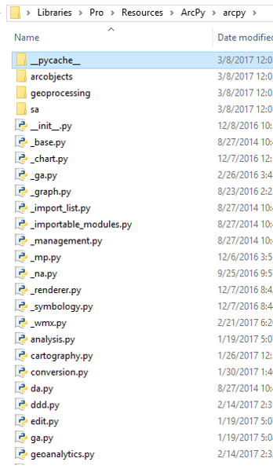
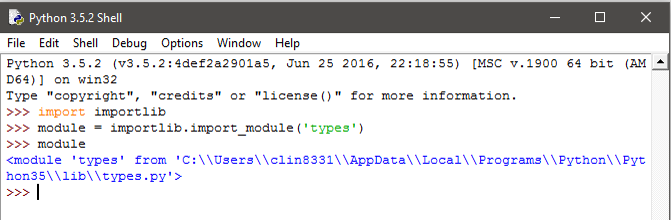

<section data-background="../img/bg_title.jpg"">
<h1>Deploying Geoprocessing Tools As Python Modules</h1>
 
<h2>Clinton Dow</h2>
</section>

What is a Python Module? {data-background="../img/bg_right.jpg"}
============================================================

Python Modules {data-background="../img/bg_left.jpg"}
--------------------------------------------------------------------

- A module is a Python file ending in .py
- Groups related functions, classes and metadata
- Python Naming Convention (PEP8)
    - lower_case_name_with_underscores
- A python package is composed of several modules
    - A python package is a folder containing __init__.py
    - Groups modules with related or complimentary concepts

{class="tight"}

Import Statement {data-background="../img/bg_left.jpg"}
---------------------------------------------------------------------------------------------------------------------

- Pulls the functions in an imported module into the globals() namespace
    - These become accessible ‘globally’ within that Python process
    - Alias given at import time only accessible within the calling module
    - Ie: ‘import arcpy’
        - Can type arcpy.member_name only within the importing module
        - If imported in a second module, there is no load time
- Module Objects
    - Reference objects to the imported module’s collection of function 
    bytecode
    - Define what is visible to consumers via __all__ = [] list of strings
    - Used by most ‘intellisense’ style auto-complete
    - Currently arcpy.da does NOT have an __all__ therefore it does not 
    autocomplete

importlib {data-background="../img/bg_left.jpg"}
------------------------------------------------------------------------------------------------------

- Introduced in Python 3.1
    - Deprecates the ‘imp’ module
- Importlib.import_module(‘module_name’) will return a module object
    - Explore modules by assigning the module object and looking at it’s dir()
    - dir() lists all members in a module (including _private members)
        - Functions/Classes/Variables with a leading _
        - Not imported with ‘import *’ – unless added explicitly to __all__

{class="tight"} 

Importing Best Practices {data-background="../img/bg_left.jpg"}
------------------------------------------------------------------------

- Break functionality into small modules, import the finest grain of 
functionality
- Control loading of multiple modules via __init__.py in a Package
- Do not use ‘from library import *’ in modules designed to be consumed
    - May cause namespace collisions
        - Two members from different modules with the same name
    - Avoid by importing explicitly 
        - ‘from library import member_name’
    - Correct namespace collisions using as keyword
        - ‘from library import member_name as unique_member_name’

Importing Best Practices {data-background="../img/bg_left.jpg"}
------------------------------------------------------------------------

- Use importlib to access module objects
    - Useful for ‘lazy loading’ of specific modules
    - Also for conditional loading of specific modules
- Liberal use of _private variable names
    - Hides most unwanted access to members
    - Impossible to completely hide a member in Python
- Concise import statements 
    - Be mindful of namespace collisions both down and upstream
    
{class="tight"}

How do Modules help? {data-background="../img/bg_right.jpg"}
============================================================

Code Reuse  {data-background="../img/bg_left.jpg"}
---------------------------------------------------------------

- Modular code can be consumed in many places
    - Write and test code in one place
    - Avoid duplicating functions across tools
- Regularly refactor code to facilitate reuse
    - View code as layers of functionality
        - Data Model
        - Functional Model
        - View Model
        - View
- Decreases time, money and effort spent in the future
    - Ease of use
    - ‘Self Documenting’
    - Don’t reinvent the wheel
    
    
Testability  {data-background="../img/bg_left.jpg"}
---------------------------------------------------------------

- Testing smaller increments of functionality in modules
    - Focused testing
    - Limited exposure to side-effects from other code
    - Easy-to-follow debugging experience
- ‘Unit Tests’
    - The smallest units of code within the module
    - Should only have one job with defined edges
        - ‘edge cases’ aka functional boundaries
- ‘Integration Tests’
    - Interoperation between each function in multiple modules
    - Harder to identify bugs
    - More involved debugging process

Interchangeability  {data-background="../img/bg_left.jpg"}
---------------------------------------------------------------

- Smaller units of code are easier to replace
    - Improved method
    - Updating variable names
- Also easier to understand
    - Reading ‘War and Peace’ vs. Reading several small books
- Quickly prototype changes
    - Create a test version with a module replaced
- Similar to building something with Lego vs. Concrete

{class="tight"}
{class="tight"}

Multiple 'Views'  {data-background="../img/bg_left.jpg"}
---------------------------------------------------------------

- Functionality like arcpy.GetParameter() in separate file from logic
- Consume modularized ArcPy code:
    - .tbx
    - .pyt
    - Python Window
    - Command Line
- Only write the tool one time
- Toolboxes provide different validation functionality
    - .tbx through the Geoprocessing pane in application
    - .pyt through python code in the toolbox file

Thank you!! Questions/Comments?? cdow@esri.com {data-background="../img/bg_title.jpg"}
==============================================================================================